<div align="center">

# HomeCenter

**Your home's memory, kept on your own server.**

Track homes, vehicles, equipment and family health in one place: service history, costs, warranties, reminders and every receipt, searchable in seconds.

**[Install in 5 minutes](#get-started)** · [Features](#features) · [AI assistant](#ask-your-house-a-question) · [Updating](#updating)

  

</div>

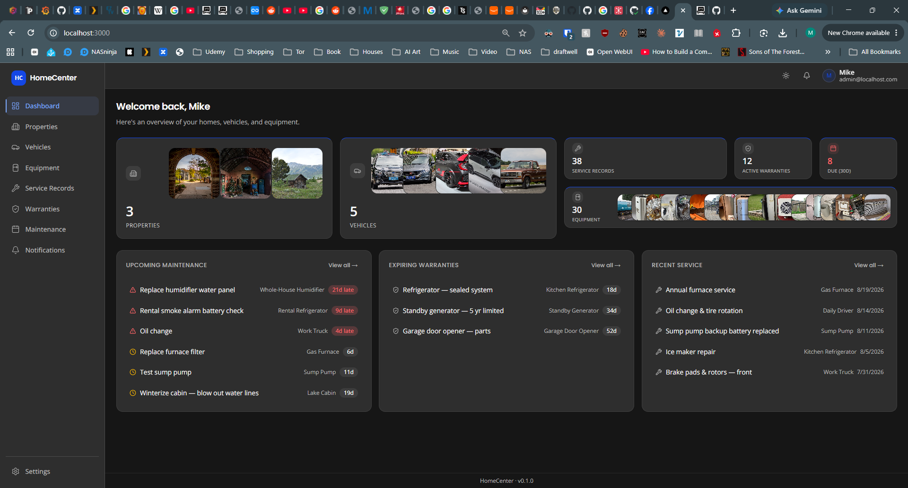

<p align="center">
✓ Runs on your NAS or server &nbsp;·&nbsp; ✓ No third-party sign-in &nbsp;·&nbsp; ✓ OCR and search run on-device &nbsp;·&nbsp; ✓ Works with local AI models
</p>

## Features

When was the furnace last serviced? Is the fridge still under warranty? What did the truck cost last year? HomeCenter keeps the answers in one place, and reminds you before things are due.

| | |
|---|---|
| **Home** | Properties, vehicles and equipment, with service records, warranties and reminders |
| **Health** *(optional)* | People, providers and insurance, with visits, medications and immunizations |
| **Money** | Costs by asset, category and vendor, and a 12-month spending chart |
| **Finding things** | Global search across records and documents, plus an optional AI assistant |
| **Reminders** | In-app bell and per-person email digests |
| **Records & export** | Attachments, printable reports and one-click zip downloads |
| **Security** | Local login, admin and standard users, sign-in throttling, encrypted secrets |

### Every house, car and appliance, with its whole history

Give each thing you own a page: photo, details, and every repair, warranty and reminder attached to it.

- **Properties:** houses, condos, cabins and land.
- **Vehicles:** service history that tracks mileage.
- **Equipment:** linked to the property it's in, with model and serial numbers.
- **Download all files** for any asset as a zip.

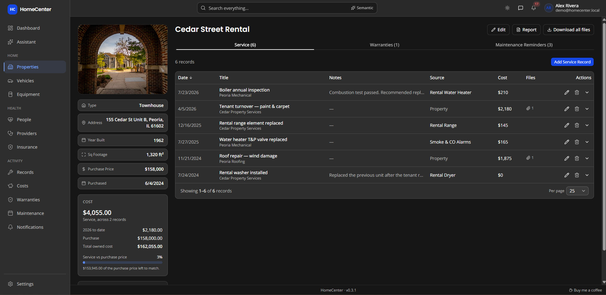

<p>
<a href="docs/screenshots/2.Properties.png">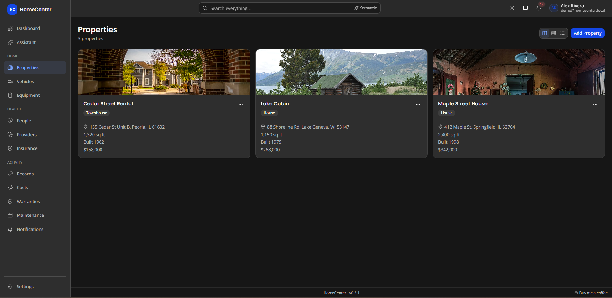</a>
<a href="docs/screenshots/7.Vehicles.png">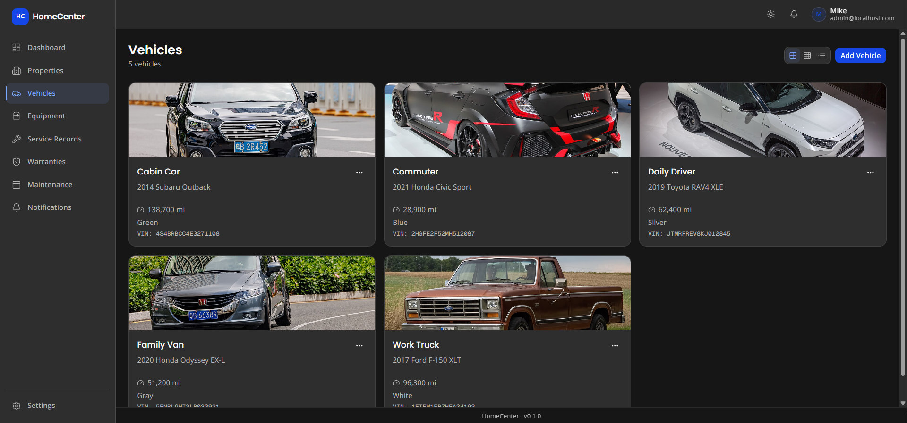</a>
<a href="docs/screenshots/8.VehicleService.png">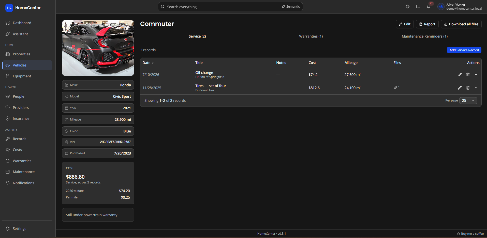</a>
<a href="docs/screenshots/9.Equipment.png">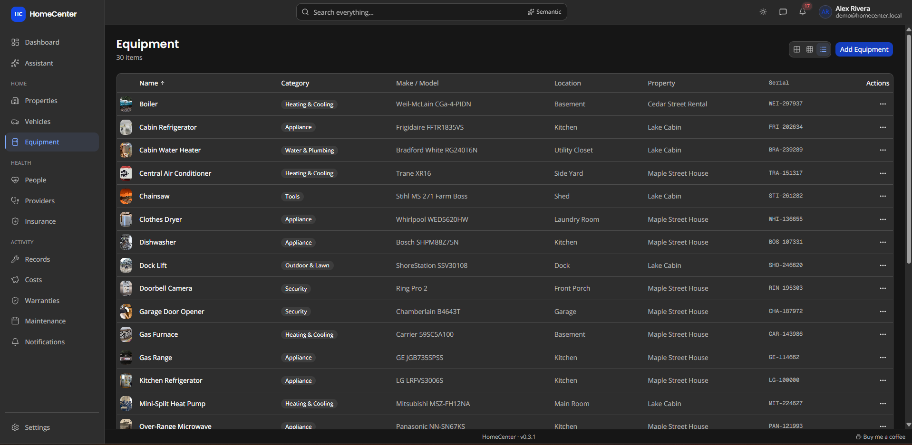</a>
</p>

### Know what's due before it's overdue

Set a reminder once, by days or miles. HomeCenter works out the next due date and tells you in time.

- **Date or mileage** intervals, with as much warning as you want.
- **Warranty status** at a glance: active, expiring or expired.
- **Overviews** across every asset, sortable and filterable.
- **Logging a service** moves the reminder forward.

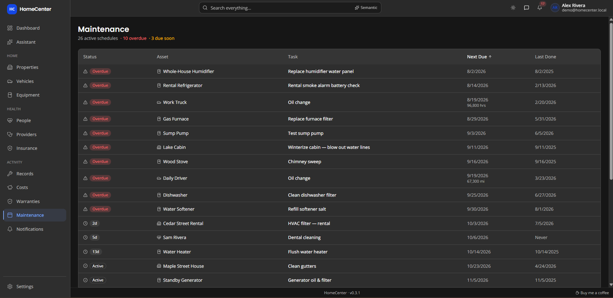

<p>
<a href="docs/screenshots/6.MaintenanceReminders.png">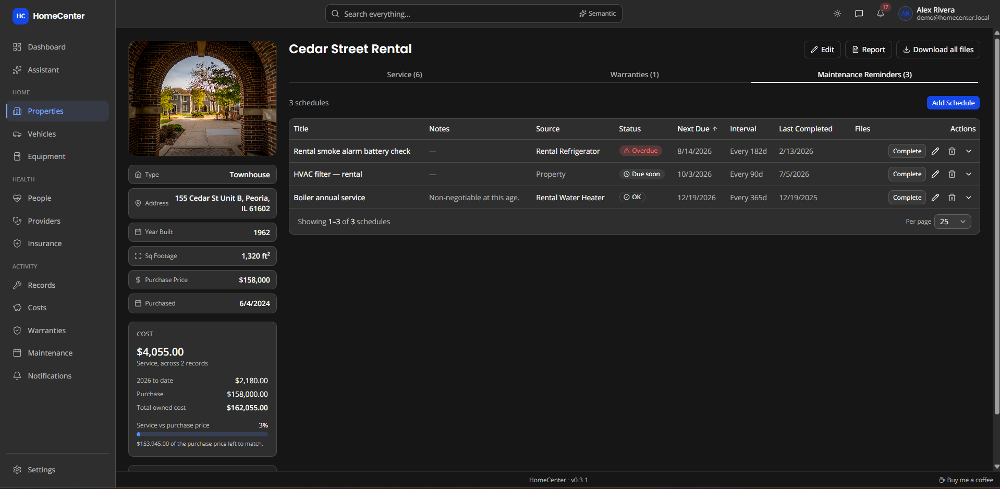</a>
<a href="docs/screenshots/5.Warranties.png">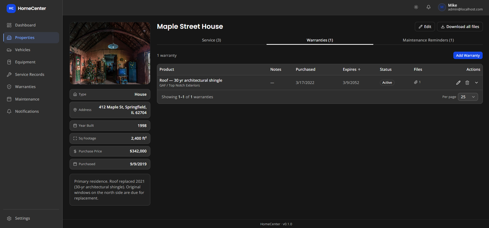</a>
<a href="docs/screenshots/10.WarrantyOverview.png">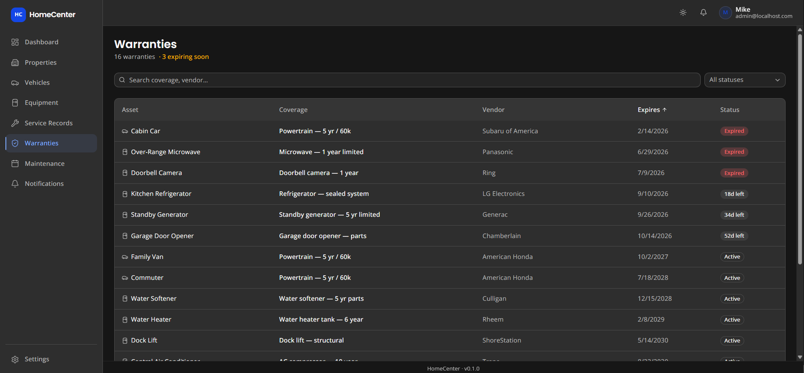</a>
<a href="docs/screenshots/4.ServiceRecord.png">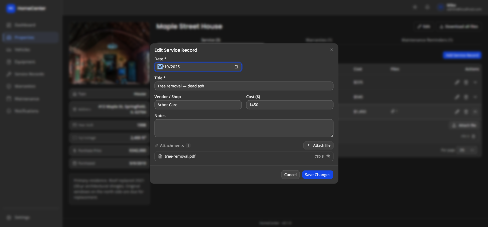</a>
</p>

### Your family's health records, close at hand *(optional)*

Keep each person's medical picture in one place, and print a clean summary for the next appointment.

- **Conditions, medications, allergies** and immunizations.
- **Visits** linked to providers, with costs.
- **Observation logs** to spot symptom patterns.
- **Refill, vaccine and insurance** reminders.
- If you don't need it, turn the whole section off in **Settings → Features**.

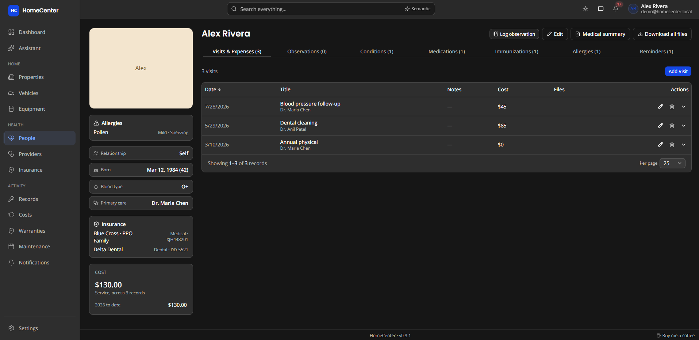

<p>
<a href="docs/screenshots/14.Providers.png">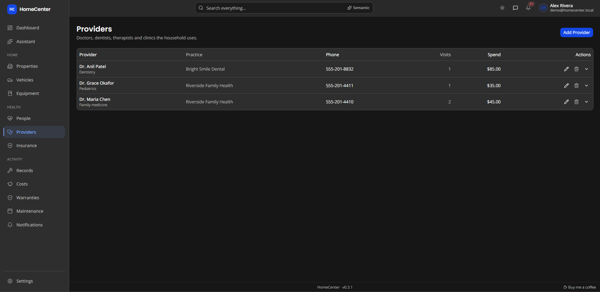</a>
<a href="docs/screenshots/15.Insurance.png">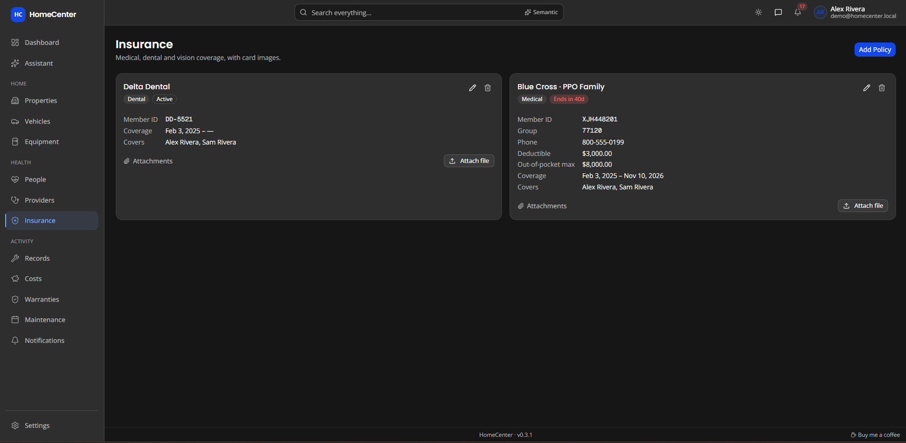</a>
<a href="docs/screenshots/16.MedicalSummary.png">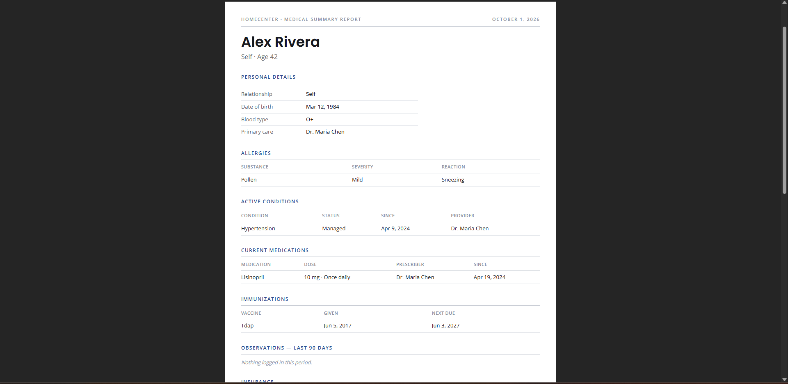</a>
</p>

### See where the money goes

Every service record carries a cost. HomeCenter adds them up across the whole household.

- **Monthly, quarterly or yearly** trends with a rolling average.
- Top assets, categories and vendors.
- **Biggest expenses** and year-to-date totals.
- Filter to properties, vehicles, equipment or people.

<p>
<a href="docs/screenshots/17.Costs1.png">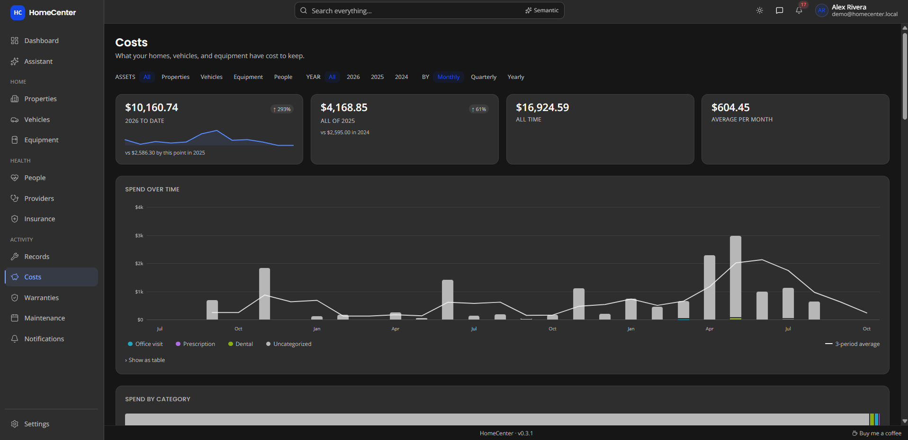</a>
<a href="docs/screenshots/17.Costs2.png">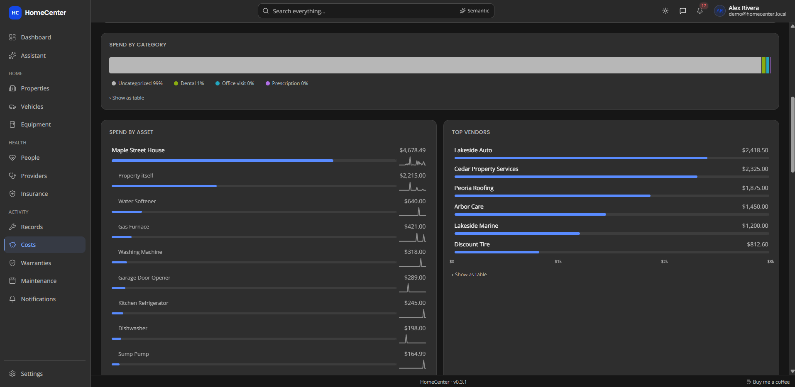</a>
</p>

### Find anything, even inside the manual

One search box covers assets, records and the text of every file you've uploaded. Ask in your own words and it finds what you meant.

- **Reads** PDF, Word, Excel, PowerPoint, OpenDocument, RTF and text files.
- **OCR** for photos and scanned PDFs.
- **Search by meaning**, using a small model that runs on your server.
- Indexing and OCR run in the background, on your server.

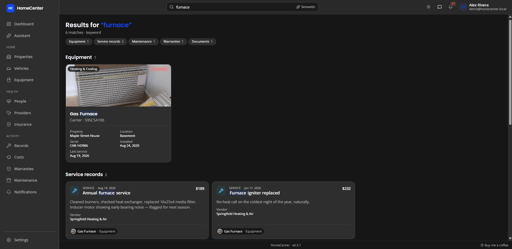

### Ask your house a question

The assistant *(optional)* looks up your records and documents to answer plain-language questions, with links back to the source.

- Works with OpenAI, OpenRouter, Ollama, LM Studio or any OpenAI-compatible server.
- **Run it fully local** and nothing leaves your network.
- You choose whether it may read documents and health data.
- Chats stay in your browser and are never stored on the server.

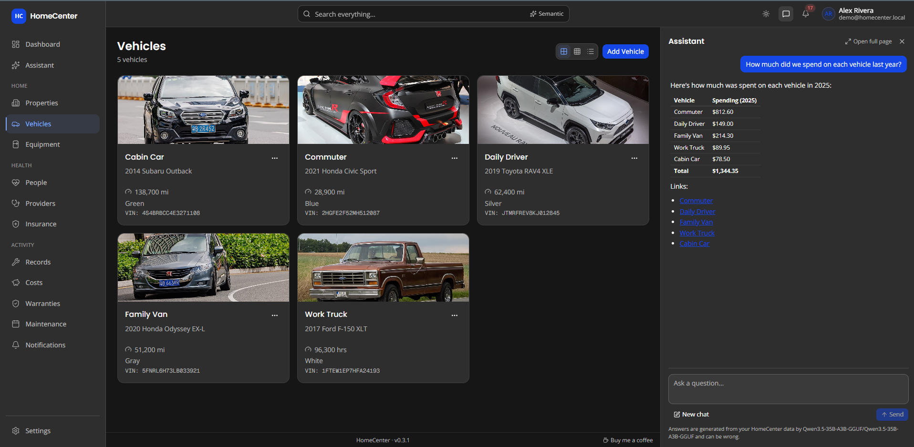

### Reminders and reports

Reminders arrive in the app and, if you like, by email. Reports turn an asset's history into a document you can hand to a buyer, a mechanic or a doctor.

- **Email digests** for each person: as soon as possible, daily or weekly.
- **Mail server set up in Settings**, with a test button.
- **Dismiss and restore** notifications.
- **Printable asset reports** and medical summaries.

<p>
<a href="docs/screenshots/18.Notifications.png">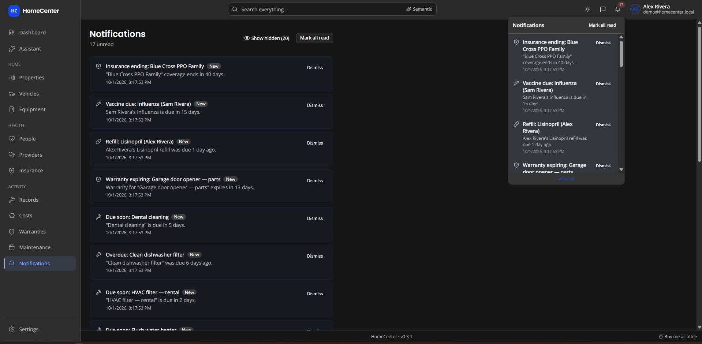</a>
<a href="docs/screenshots/12.EmailNotifications.png">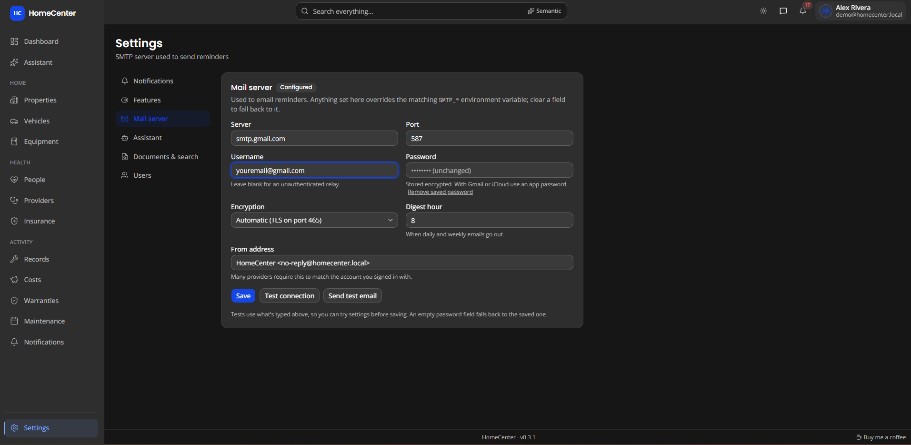</a>
<a href="docs/screenshots/19.AssetReport.png">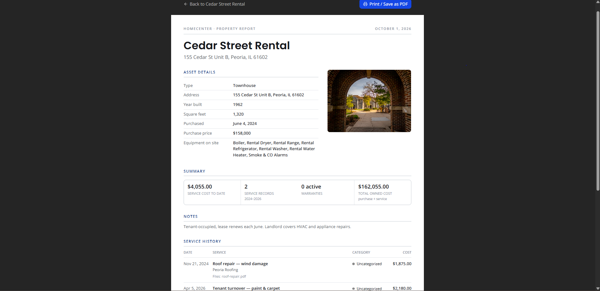</a>
</p>

## Private by design

HomeCenter is one container and one data folder, and you own both.

- **Self-hosted:** runs on a Synology, Unraid or any Docker host. Updates never touch your data folder.
- **On-device processing:** OCR and meaning search run inside the container. Their only network call is an optional model download.
- **You decide:** the AI assistant stays off until you turn it on, and Health can be hidden entirely. Login is local, users are admin or standard, repeated failed sign-ins are slowed down, and the mail password and API key are encrypted at rest.

<sub>Photos in the screenshots are from <a href="https://commons.wikimedia.org/">Wikimedia Commons</a>, by various authors, under their individual licenses (mostly CC BY-SA).</sub>

## Get started

Setup takes about five minutes. You need:

| Requirement | Why |
|---|---|
| Docker + Docker Compose | How the app runs. No Node.js or build setup needed. |
| A folder on the host for data | Holds the database and uploaded files, and survives updates |
| ~5 minutes | To set one required value and start the container |

### Install (Docker)

This is the recommended way to run HomeCenter.

**1. Create a folder for its data**, e.g. on a Synology NAS:

```bash
mkdir -p /volume1/docker/homecenter
```

**2. Save this as `docker-compose.yml`** (or paste it into Portainer → Stacks → Add stack):

```yaml
services:
  homecenter:
    image: ghcr.io/yatzin/homecenter:latest
    ports:
      - "3000:3000"
    volumes:
      - /volume1/docker/homecenter:/data
    environment:
      DATABASE_URL: "file:/data/homecenter.db"
      AUTH_SECRET: ""
      AUTH_URL: ""
      MAX_UPLOAD_BYTES: "26214400"
      ADMIN_NAME: "Admin"
      ADMIN_EMAIL: "your@email.com"
      ADMIN_PASSWORD: "changeme"
    restart: unless-stopped
    healthcheck:
      test: ["CMD", "wget", "-qO-", "http://127.0.0.1:3000/api/health"]
      interval: 30s
      timeout: 10s
      retries: 3
      start_period: 10s
```

Update the volume path to the folder you created in step 1.

**3. Set these values:**

| Variable | Required? | What to put |
|---|---|---|
| `AUTH_SECRET` | **Yes** | A random secret: `openssl rand -base64 32`. Without it, logins won't work. |
| `AUTH_URL` | No | The address you'll browse to, e.g. `http://192.168.1.50:3000`. Leave blank to auto-detect it. |
| `ADMIN_EMAIL` / `ADMIN_PASSWORD` | No | Your login, used once on first boot to create the admin account and ignored after that. If you remove `ADMIN_PASSWORD`, the password is `changeme` and you must change it on first login. Without `ADMIN_EMAIL`, the email is `admin@localhost`. |
| `NOTIFY_INTERVAL_MINUTES` | No | How often to check for due maintenance and expiring warranties. Defaults to `360` (6 hours). Set `0` to turn reminders off. |
| `SMTP_HOST` | No | Your mail server, e.g. `smtp.gmail.com`. **Leave blank and no email is ever sent.** The in-app bell still works. |

Everything else can stay at its default. Uploads (`/data/uploads`) and downloaded models (`/data/models`) are kept in the data folder automatically.

**4. Start it:**

```bash
docker compose up -d
```

(Portainer: click **Deploy the stack**.)

The container sets up its database and admin account automatically on first boot.

**5. Log in** at `http://<your-server-ip>:3000/login` with the admin email/password from step 3.

## Optional extras

HomeCenter works fully without these. Add them when you want them.

### Email notifications (optional)

Until a mail server is set up, reminders only appear in the app. There are two
ways to configure one.

**In the app** (easiest): sign in as an admin and go to **Settings → Mail
server**. Fill in the server, port, and login, save, then use **Send test
email** to confirm it works. No restart needed, and the password is stored
encrypted with your `AUTH_SECRET`.

**Or by environment variable**, if you'd rather bake it into the container:

| Variable | Default | What it does |
|---|---|---|
| `SMTP_HOST` | — | Mail server hostname. Nothing sends until this is set. |
| `SMTP_PORT` | `587` | `465` for implicit TLS, `587` for STARTTLS. |
| `SMTP_USER` / `SMTP_PASS` | — | Login for the mail server. With Gmail or iCloud, use an **app password**, not your account password. Omit both for an unauthenticated LAN relay. |
| `SMTP_SECURE` | auto | `true` forces TLS. Defaults to on for port 465, off otherwise. |
| `MAIL_FROM` | `HomeCenter <no-reply@homecenter.local>` | The From address. Many providers require this to match the authenticated account. |
| `DIGEST_HOUR` | `8` | Hour of day (0–23) for daily and weekly digests. |
| `MAIL_DRY_RUN` | — | `1` logs each message instead of sending it, so you can check the setup safely. |

**Anything set in Settings wins over the environment variable**, and clearing a
field in Settings falls back to it. The form labels which values came from the
environment, so it's clear what's in effect.

Because the stored password is encrypted with `AUTH_SECRET`, **changing
`AUTH_SECRET` makes it unreadable**. The app detects this, stops sending rather
than failing silently, and Settings prompts you to enter the password again.

Each user picks their own cadence under **Settings → Notifications**: off,
as soon as possible, daily, or weekly. New accounts default to daily.

Two caveats:

- Delivery is driven by the same timer as the reminder check, so a digest goes
  out on the first pass **at or after** `DIGEST_HOUR`, not exactly at it. With
  the default 6-hour interval it can be up to 6 hours late. Lower
  `NOTIFY_INTERVAL_MINUTES` if you want tighter timing.
- "As soon as possible" likewise means the next pass, not instantly.

**Who and how often.** An admin picks which accounts get notifications under
**Settings → Notifications → Who gets notifications** (everyone, by default).
Each person then chooses how often the same due item is raised again:

| Option | What you get |
|---|---|
| When it's coming up, and on the due date *(default)* | One heads-up, then one on the day |
| Only once | A single reminder |
| Every check until dismissed | Comes back after you read it, until you dismiss it |

A new due date always starts afresh, for example after you log the service or
move a refill date. Emails cover only new or re-raised reminders, so lowering
the interval doesn't mean repeat messages, except with "every check until
dismissed".

### AI assistant (optional)

Sign in as an admin and go to **Settings → Assistant**. Pick a provider (OpenAI,
Ollama, LM Studio, OpenRouter or any OpenAI-compatible server), enter the model
name and, if the provider needs one, an API key (stored encrypted). Use **Test
connection** to confirm the model supports tool calling, which the assistant needs.

Questions, and the records needed to answer them, are sent to that server,
including health records. Point it at a local model if that matters to you. When
HomeCenter runs in Docker, `localhost` means the container: use the host's
address (e.g. `http://host.docker.internal:11434/v1`) for a model running on the
host.

For Ollama, raise the context length. The default is too short for the tool
definitions and results, so answers get cut off or ignore the data. Set
`OLLAMA_CONTEXT_LENGTH=16384` (or more) on the Ollama server. Models of 7B
parameters or larger are recommended; small models often call the tools wrongly
or not at all.

For slow local models, **Time limit per question** (default 180 seconds) caps the
whole answer, including waiting for the model to load or read the prompt.
Raise it if answers time out. Once a reply starts streaming, it also stops if
the server then sends nothing for 60 seconds. **Extra request JSON** passes
server-specific options with every request, e.g.
`{"chat_template_kwargs": {"enable_thinking": true}}` to turn on a model's
thinking in llama.cpp or vLLM, or `{"reasoning_effort": "low"}` for OpenAI
reasoning models.

Chats stay in your browser tab and are never stored on the server.

### Document search (optional)

HomeCenter reads the text of uploaded files in the background (PDF, Word
(.doc/.docx), OpenDocument, PowerPoint, Excel, RTF, text/CSV, and photos or
scanned PDFs via OCR) and indexes it so the assistant can search it. It runs
entirely inside the container; nothing is sent anywhere until the assistant
uses a passage to answer a question.

**Settings → Documents & search** turns indexing and OCR on or off and shows progress.
**Settings → Assistant** decides whether the assistant may read documents at
all, and separately whether it may read health documents (files on anything
that belongs to a person, such as their visits, reminders and medications). That one is off
by default.

| Variable | Default | Meaning |
|---|---|---|
| `SEARCH_INDEX_PATH` | next to the database (`/data/search-index.db`) | The keyword index. Derived data: it doesn't need backing up and is rebuilt automatically if missing. |
| `DOCUMENT_REINDEX_HOURS` | `6` | How often to pick up missed or failed files. `0` disables the timer (uploads are still indexed immediately). |

Not indexed: iWork files, .zip, legacy .xls/.ppt and HEIC photos.

#### Search by meaning

Besides exact words, HomeCenter can find passages by meaning ("how often do I
swap the furnace filter?" finds "replace every 90 days"). A small AI model runs
**on your server**, so no document text leaves it for this. The model loads only
while documents are being indexed or searched, and unloads when idle.

**Settings → Documents & search → Find documents by meaning** turns it on or off and
picks the model:

| Model | Size | Good for |
|---|---|---|
| BGE small (built in) | 34 MB | Fast, English |
| Arctic Embed M | 110 MB | Best quality for its size, English (recommended upgrade) |
| BGE base | 110 MB | Better quality, English |
| Nomic Embed Text | 137 MB | Good quality, English |
| E5 base | 279 MB | Many languages |
| BGE large | 337 MB | Highest quality, slow on small hosts |

Larger models download from Hugging Face when you click **Download** (the
only time HomeCenter goes online for this) and are stored in `/data/models`.
Switching models re-processes your documents in the background.

| Variable | Default | Meaning |
|---|---|---|
| `MODELS_DIR` | `/data/models` | Where downloaded models are kept. |
| `EMBEDDING_IDLE_MINUTES` | `10` | Unload the model this long after the last search. `0` unloads right after each search. |

## Updating

Pull the new image and recreate the container. Your data folder is untouched:

```bash
docker compose pull && docker compose up -d
```

In Portainer: **Pull and redeploy**.

From this version the image is based on Debian slim instead of Alpine. Nothing changes for you: pull and recreate as usual.

## Local development

For working on the app itself, not for regular use.

```bash
npm install
cp .env.example .env   # fill in AUTH_SECRET
npm run db:seed
npm run dev
```

Runs at [http://localhost:3000](http://localhost:3000), database at `prisma/dev.db`.

```bash
npm run db:migrate   # create/apply a migration
npm run db:studio    # browse the database
npm run build         # production build
```

`npm run models:fetch-builtin` downloads the built-in model into `./models/builtin/` (needed once for meaning search in development).

Images are built and published automatically by `.github/workflows/docker-publish.yml` on every push to `main`. To build locally: `docker build -t home-center .`

---

<p align="center">Free and open source under the MIT licence.</p>
